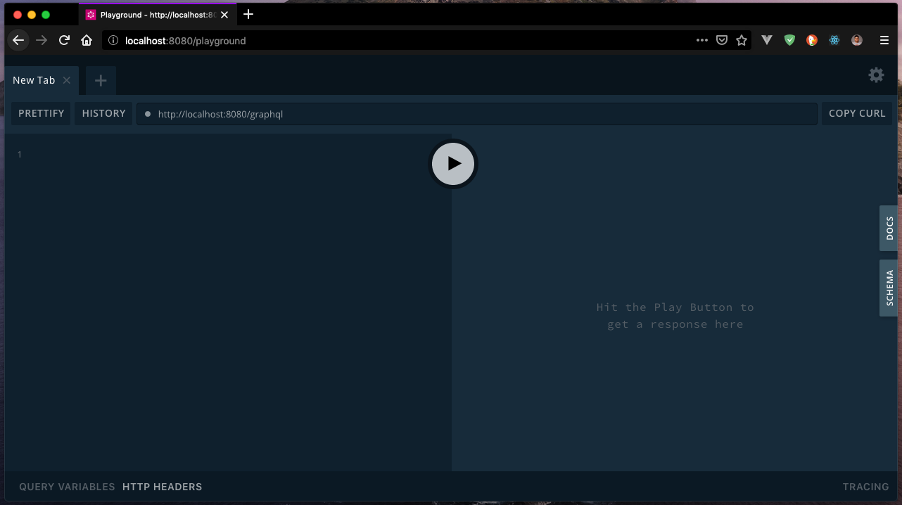
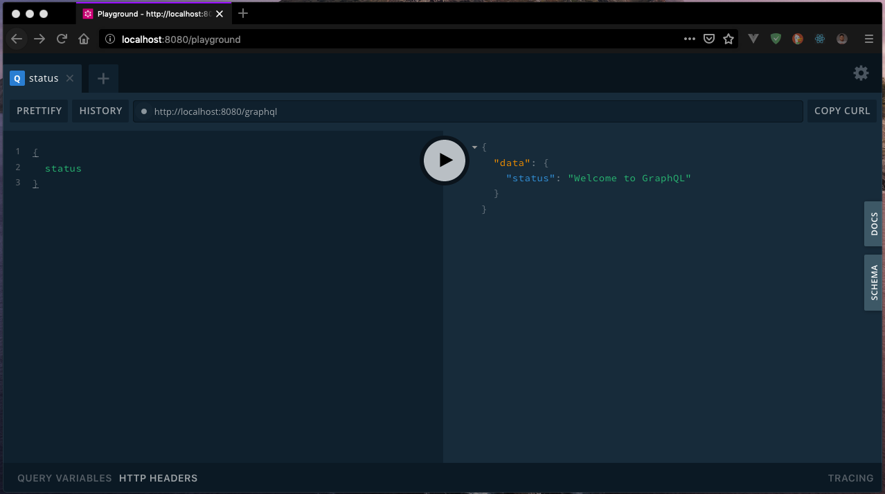

##### EJEMPLO 01
## CONFIGURACIÓN DE GRAPHQL CON EXPRESS
### OBJETIVO
Configurar el servicio de GraphQL en una aplicación de Express.

### REQUERIMIENTOS
1. Proyecto Base con Express.

### DESARROLLO
1. Instalar dependencias necesarias para implementar GraphQL.
```sh
$ npm i --save graphql apollo-server-express graphql-playground-middleware-express
```

2. Crear dentro de `src` el directorio `schema` y agregar el archivo `schemaDefinition.graphql`.
```graphql
schema {
  query: Query
}
```

3. Crear dentro de `src/schema` el archivo `query.graphql`.
```graphql
type Query {
  status: String
}
```

4. Crear dentro de `src/schema` el archivo `index.js` para importar los GraphQL Queries.
```js
// Import schema definition
import SchemaDefinition from './schemaDefinition.graphql';

// Import Queries
import Query from './query.graphql';

export default [SchemaDefinition, Query];
```

5. Crear dentro de `src` el directorio `resolvers` y agregar el archivo `query.js` donde agregaremos la lógica de negocio de los GraphQL Queries.
```js
const Query = {
  status: () => 'Welcome to GraphQL', // Resolver para el Query status
};

export default Query;
```

6. Crear dentro de `src/resolvers` el archivo `index.js` donde exportaremos todos los Queries generados.
```js
import Query from './query';

const resolvers = {
  Query,
};

export default resolvers;
```

7. Ahora, dentro del archivo `src/index.js` vamos a configurar nuestro servidor GraphQL para eso, vamos a necesitar importar las dependencias de GraphQL.
```js
import { ApolloServer } from 'apollo-server-express';
import ExpressPlayground from 'graphql-playground-middleware-express';
```

8. También, vamos a necesitar importar nuestro `schema` de GraphQL y los `resolvers`.
```js
import schema from './schema';
import resolvers from './resolvers';
```

9. A continuación, vamos a utilizar `ApolloServer` para crear nuestro servidor de GraphQL y en este, añadiremos la definición del `schema` y los `resolvers`.
```js
// Added schema definitions and resolvers
const server = new ApolloServer({
  typeDefs: schema,
  resolvers,
});
```

10. Así mismo agregaremos el middleware `applyMiddleware` que nos permitirá montar GraphQL en un mismo `path`.
```js
server.applyMiddleware({ app });
```

**Nota**: Esto deberá estar antes de `app.use(boom())` y la definición de `urlencoded` y `express.json()`.

11. Ahora, vamos a configurar una herramienta que nos permitirá hacer las pruebas de consultas hacía nuestro API, en este caso, GraphQL Playground.
```js
app.get('/playground', ExpressPlayground({ endpoint: '/graphql' }));
```

12. Por ahora, la estructura debería mostrarse de la siguiente forma.
```
.
├── .babelrc
├── .env
├── .gitignore
├── nodemon.json
├── package.json
├── src
│   ├── index.js
│   ├── resolvers
│   │   ├── index.js
│   │   └── query.js
│   └── schema
│       ├── index.js
│       ├── query.graphql
│       └── schemaDefinition.graphql
└── package-lock.json
```

13. Para comprobar que todo funciona, vamos a ejecutar nuevamente nuestro proyecto.
```sh
$ npm run dev
```

14. Ahora, vamos a dirigirnos a `0.0.0.0:8080/graphql` o por el puerto que hayas especificado en tu `.env`. Deberias poder ver el cliente para lanzar peticiones.

15. Una vez comprobamos que el servicio esta ejecutado, vamos a usar la herramienta GraphQL Playground para comprobar que nuestro API responda a una petición.



16. Introducimos la siguiente consulta al API en el editor de GraphiQL y ejecutamos dando clic en el botón de `play`.
```
{
  status
}
```

17. Si todo ha resultado como debería, obtendrás la siguiente respuesta por parte del API.

