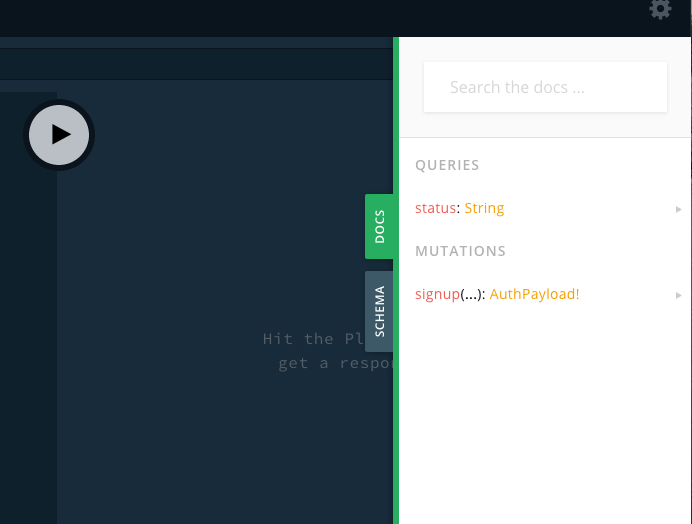
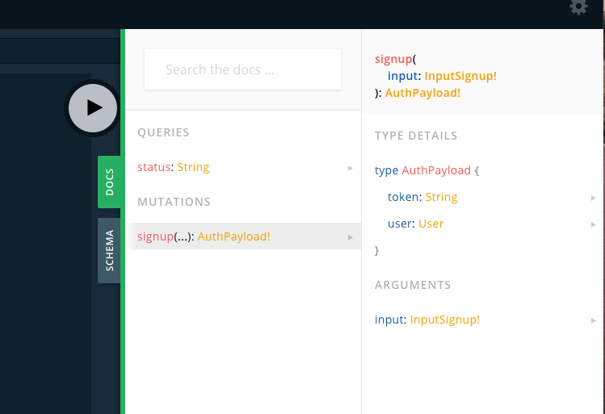
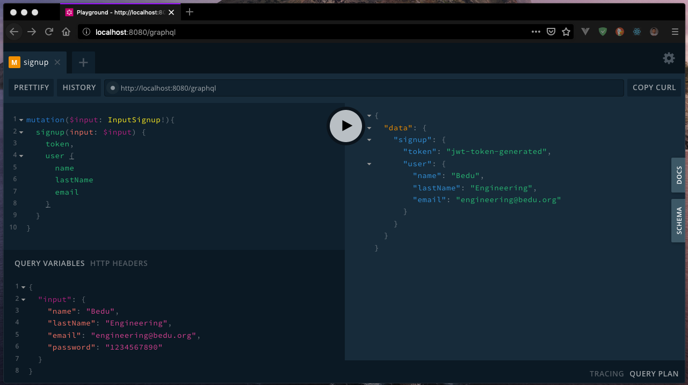

##### EJEMPLO 02
## AGREGAR USUARIOS CON GRAPHQL
### OBJETIVO
Crear una mutación que permita registrar usuarios en la aplicación.

### REQUERIMIENTOS
1. Proyecto con GraphQL API. [Ejemplo 01](../Ejemplo-01).
2. Mongo 4 o superior. [Download](https://www.mongodb.com/download-center/community).

### DESARROLLO
1. Instalar dependencias para encriptar nuestras contraseñas y controlar las acciones en Mongo DB.
```sh
$ npm i --save bcryptjs mongoose
```

2. Vamos a registrar una nueva variable de entorno en nuestro archivo `.env`, está nos permitirá mantener la conexión con nuestra base de datos.
```sh
APP_MONGO_URI=mongodb://localhost/bedu-travels
```
**Nota:** Recuerda que `localhost` hace referencia a nuestro mismo equipo, por lo que si trabajas con una base de datos en un servidor, deberás colocar la URL de conexión utilizando la dirección IP del servidor, usuario y contraseña. Puedes consultar la documentación [aquí](https://docs.mongodb.com/manual/reference/connection-string/).

3. Una ves hemos especificado nuestra variable de conexión a Mongo, vamos a configurar la herramienta `Mongoose` para conectarnos a nuestro servicio de Mongo. Para eso nos dirigimos a `src/index.js` y vamos a modificar la sección en donde se habilita el puerto en el que se montará nuestra aplicación.
```js
mongoose.connect(APP_MONGO_URI, { useNewUrlParser: true }).then(() => {
  app.listen(APP_PORT, () => {
    console.log(`GraphQL API Service: 0.0.0.0:${APP_PORT}/graphql`);
    console.log(`GraphQL Playground: 0.0.0.0:${APP_PORT}/graphiql`);
    console.log(`Mongo DB Service: ${APP_MONGO_URI}`);
  });
}).catch(err => {
  throw new Error(err);
});
```

4. También, dentro de `src/index.js`, vamos a obtener el valor de nuestra variable para poder utilizarla en el código anterior. Para eso, vamos a colocarla por debajo de `APP_PORT`.
```js
const APP_PORT = process.env.APP_PORT || 8080;
const APP_MONGO_URI = process.env.APP_MONGO_URI;
```

5. Ejecutamos nuestro proyecto utilizando `npm run dev` y deberíamos poder observar los siguientes mensajes.
```sh
GraphQL API Service: 0.0.0.0:8080/graphql
GraphQL Playground: 0.0.0.0:8080/playground
Mongo DB Service: mongodb://localhost/bedu-travels
```

6. Ahora, vamos a crear los `schemas` de datos necesarios para que GraphQL detecte la mutación para registrar a nuestros usuarios. Para ello, primero ocupamos agregar el tipo de `Mutation` dentro del archivo `src/schema/schemaDefinition.graphql`.
```graphql
schema {
  query: Query
  mutation: Mutation
}
```

7. Una vez definido el `schema` de `Mutation`, ahora ya podemos definir la mutación necesaria para registrar a un usuario. Para eso, vamos a crear dentro de `src/schema` el archivo `mutation.graphql`.
```graphql
type Mutation {
  signup(input: InputSignup!): AuthPayload!
}

input InputSignup {
  name: String!
  lastName: String!
  email: String!
  password: String!
} 
```

8. Una vez que definimos nuestra mutación, podemos apreciar que tenemos un tipo `AuthPayload` como el valor que debe ser devuelto por la mutación, pero este tipo no existe dentro de GraphQL por lo que tendremos que definirlo para que GraphQL pueda entender a que nos referimos. Para poder definir nuestros `types` personalizados dentro de GraphQL, vamos a necesitar crear un nuevo archivo dentro de `src/schema` llamado `types.graphql`.
```graphql
type User {
  _id: String
  name: String
  lastName: String
  email: String
  dateBirth: String
  createdAt: String
  updatedAt: String
}

type AuthPayload {
  token: String
  user: User
}
```
**Nota:** El tipo `User` pertenece a los valores que podremos obtener del mismo.

9. Ahora una vez que definimos nuestras mutaciones y nuestros tipos, tenemos que exportarlos dentro del archivo `src/schema/index.js`.
```js
// Import schema definition
import SchemaDefinition from './schemaDefinition.graphql';
import Types from './types.graphql';

// Import Queries and Mutations
import Query from './query.graphql';
import Mutation from './mutation.graphql';

export default [SchemaDefinition, Types, Query, Mutation];
```

10. El siguiente paso, es agregar la lógica con la que que GraphQL va a responder a través de la mutación. Para lograr esto, primero vamos a tener que generar nuestro modelo de usuario para almacenar los datos dentro de Mongo DB, generaremos un nuevo directorio dentro de `src` llamado `models`, el cuál se encargará de almacenar todos los modelos requeridos por nuestra aplicación, para ello, dentro del directorio `src/models` vamos a generar un nuevo archivo `User.js` en donde especificaremos el `schema` de datos de Mongo usando Mongoose.
```js
import mongoose, { Schema } from 'mongoose';

// Mongoose Schema
const UserSchema = new Schema({
  name: String,
  lastName: String,
  email: String,
  dateBirth: String,
  password: String,
}, {
  timestamps: true,
});

// Mongoose Model
const UserModel = mongoose.model('User', UserSchema);
export default UserModel;
```

11. Una vez creamos nuestro modelo de datos, vamos a agregar a nuestros `resolvers` la lógica de la mutación. Para ello, vamos a crear un nuevo archivo dentro de `src/resolvers` llamado `mutation.js` y posteriormente lo definiremos dentro de `src/resolvers/index.js`.
```js
// src/resolvers/mutation.js
import User from '../models/User';
import bcrypt from 'bcryptjs';

const Mutation = {
  signup: async (parent, { input }) => {
    const { email, password, name, lastName } = input;

    const user = await User.findOne({ email });
    if (user) {
      throw new Error('This email is already in use');
    }

    const encryptedPassword = await bcrypt.hash(password, 10);
    const newUser = new User({
      name,
      lastName,
      email,
      password: encryptedPassword,
    });
    newUser.save();

    return {
      token: 'jwt-token-generated',
      user: newUser,
    };
  },
};

export default Mutation;
```
```js
// src/resolvers/index.js
import Query from './query';
import Mutation from './mutation';

const resolvers = {
  Query,
  Mutation,
};

export default resolvers;
```

12. Hasta este punto deberías tener la siguiente estructura.
```
.
├── README.md
├── nodemon.json
├── package.json
├── src
│   ├── index.js
│   ├── models
│   │   └── User.js
│   ├── resolvers
│   │   ├── index.js
│   │   ├── mutation.js
│   │   └── query.js
│   └── schema
│       ├── index.js
│       ├── mutation.graphql
│       ├── query.graphql
│       ├── schemaDefinition.graphql
│       └── types.graphql
└── package-lock.json
```

13. Ahora, vamos a ejecutar nuevamente nuestro proyecto y vamos a dirigirnos a `http://localhost:8080/graphql` para hacer nuestras pruebas. Si todo ha ido bien, podremos observar los mensajes en consola de que nuestra aplicación ha funcionado de forma correcta. De esta forma, podremos observar dentro de GraphiQL que ahora tenemos `mutations` dentro de nuestra documentación.



14. Si hacemos clic sobre `mutation`, podremos ver las mutaciones disponibles para utilizar dentro de nuestro servicio de GraphQL, en este caso, podremos encontrar únicamente nuestra mutación de `signup`.



15. Ahora vamos a proceder a probar nuestro servicio para eso primeramente construiremos nuestra mutation a consumir y agregaremos las variables que enviaremos a nuestro servidor.

#### Mutación definida en GraphiQL
```js
mutation ($input: InputSignup!) {
  signup(input: $input) {
    token
    user {
      name
      lastName
      email
    }
  }
}
```
#### Variables enviadas a la mutación
```json 
{
  "input": {
    "name": "Javier",
    "lastName": "Diaz",
    "email": "hello@coderdiaz.me",
    "password": "1234567890"
  }
}
```

#### Si todo ha salido bien, verás el siguiente resultado.


16. Una ves GraphQL haya resuelto de forma correcta, podremos observar dentro de MongoDB nuestro nuevo usuario registrado.
```
MongoDB shell version v4.0.10
connecting to: mongodb://127.0.0.1:27017/?gssapiServiceName=mongodb
Implicit session: session { "id" : UUID("119af5d2-f693-4696-9366-1eee99d52a55") }
MongoDB server version: 4.0.10
Server has startup warnings:
2019-06-09T04:39:05.959+0000 I STORAGE  [initandlisten]
2019-06-09T04:39:05.959+0000 I STORAGE  [initandlisten] ** WARNING: Using the XFS filesystem is strongly recommended with the WiredTiger storage engine
2019-06-09T04:39:05.960+0000 I STORAGE  [initandlisten] **          See http://dochub.mongodb.org/core/prodnotes-filesystem
---
Enable MongoDB's free cloud-based monitoring service, which will then receive and display
metrics about your deployment (disk utilization, CPU, operation statistics, etc).

The monitoring data will be available on a MongoDB website with a unique URL accessible to you
and anyone you share the URL with. MongoDB may use this information to make product
improvements and to suggest MongoDB products and deployment options to you.

To enable free monitoring, run the following command: db.enableFreeMonitoring()
To permanently disable this reminder, run the following command: db.disableFreeMonitoring()
---

> use bedu-travels;
switched to db bedu-travels
> db.users.find({});
{ "_id" : ObjectId("5cfc8e86a7e5607840015036"), "name" : "Javier", "lastName" : "Diaz", "email" : "hello@coderdiaz.me", "password" : "$2a$10$pbGd/YyIl8DZYiPljelt..H6otghhKEGGTn/zfcaKrAoN4REUqhkW", "createdAt" : ISODate("2019-06-09T04:43:50.562Z"), "updatedAt" : ISODate("2019-06-09T04:43:50.562Z"), "__v" : 0 }
>
```