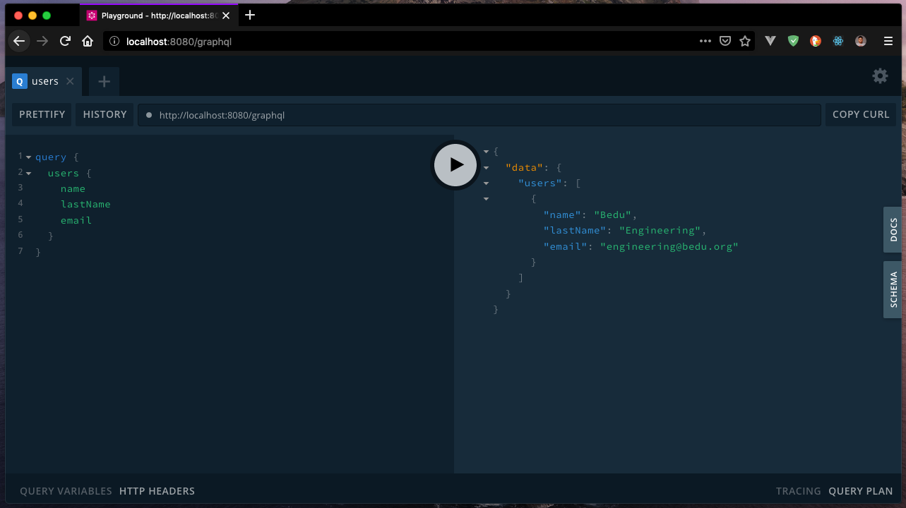

##### EJEMPLO 03
## OBTENER USUARIOS CON GRAPHQL

### OBJETIVO
Crear un Query que permita obtener los usuarios registrados.

### REQUERIMIENTOS
1. Proyecto con GraphQL API. [Ejemplo 02](../Ejemplo-02).
2. Mongo 4 o superior. [Download](https://www.mongodb.com/download-center/community).

### DESARROLLO
1. Primero, debemos registrar nuestro Query en nuestro esquema de GraphQL dentro del archivo `src/schema/query.graphql`.
```graphql
type Query {
  status: String
  users: [User]
}
```
**Nota:** Lo que estamos indicando en el schema es que el Query `users` retorna un arreglo de tipo GraphQL `User` el cuál podrás encontrar dentro del archivo `src/schema/types.graphql`.

2. Una vez definido el Query en nuestro esquema de GraphQL, procederemos a crear la lógica correspondiente para obtener los datos desde Mongo DB. Para eso, vamos a utlizar el modelo de `User` para poder obtener los usuarios utilizando el método `find()` de mongoose.
```js
import User from '../models/User';

const Query = {
  status: () => 'Welcome to GraphQL',
  users: () => {
    return User.find().exec();
  },
};

export default Query;
```

3. Ejecutamos nuevamente nuestra aplicación `npm run dev` y nos dirigimos a `http://localhost:8080/graphql`.

4. Vamos a lanzar la consulta a través del servicio de GraphQL.
```
query {
  users {
    name
    lastName
    email
  }
}
```

5. Si todo ha salido bien, deberías obtener el siguiente resultado.


