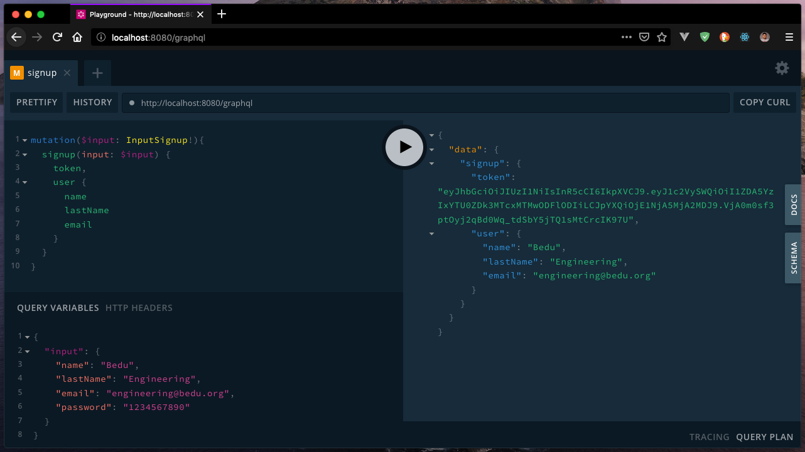
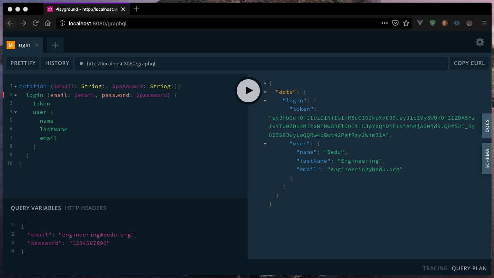

##### EJEMPLO 01
## AGREGAR PROCESO DE AUTENTICACIÓN CON JWT

### OBJETIVO
Generar un token de autorización utilizando JWT.

### REQUERIMIENTOS
1. Mongo 4 o superior. [Download](https://www.mongodb.com/download-center/community).

### DESARROLLO
1. Para lograr el objetivo de este ejercicio, debemos primeramente preparar nuestra aplicación para generar los `json-web-tokens` y darle autorización a un usuario a acceder a ciertas secciones del API. Para ello, si observamos en el archivo `src/resolvers/mutation.js` en la línea número `23`, ya habíamos preparado anteriormente el `json` a resolver, en donde colocaremos el token de `jwt` generado cuando un usuario se haya registrado.
```js
  token: 'jwt-token-generated',
```

2. Agregar una variable de entorno a nuestro archivo `.env` y cambiar el valor por una clave secreta.
```
APP_JWT_SECRET=secret
```

3. Para lograr generar los `jwt` web tokens vamos a instalar la dependencia.
```sh
$ yarn add jsonwebtoken
# or
$ npm i --save jsonwebtoken
```

4. Ahora, vamos a agregar la lógica para generar el token de autorización. Para ello, primeramente vamos a importar la dependencia dentro del archivo `src/resolvers/mutation.js` en el método `signup` y agregaremos la lógica una ves que se haya almacenado el usuario en Mongo DB.
```js
import jwt from 'jsonwebtoken'

// ...
newUser.save();

const token = jwt.sign({ userId: newUser._id }, APP_JWT_SECRET);
return {
  token,
  user: newUser,
};
```

5. Una vez modificado el método de signup, vamos a probarlo accediendo dentro de `http://localhost:8080/graphql` y lanzando la mutación de `signup` para obtener el siguiente resultado.



6. Ahora, si todo ha ido bien, vamos a agregar una nueva mutación `login` para completar el proceso de autenticación. Vamos a agregar una nueva mutación dentro del archivo `src/schema/mutation.graphql` para el proceso de `login`.

```graphql
type Mutation {
  signup(input: InputSignup!): AuthPayload!
  login(email: String!, password: String!): AuthPayload
}
```

7. Una vez agregada la mutación al schema, vamos a agregar la mutación a los resolvers, para desarrollar la siguiente lógica, dentro del archivo `src/resolvers/mutation.js`.

```js
import User from '../models/User';
import bcrypt from 'bcryptjs';
import jwt from 'jsonwebtoken';

// Getting JWT Secret from environment
const APP_JWT_SECRET = process.env.APP_JWT_SECRET;

const Mutation = {
  signup: async (parent, { input }) => {
    // ...
  },
  login: async (parent, { email, password }) => {
    const user = await User.findOne({ email }).exec();
    if (!user) {
      throw new Error('Unauthorized');
    }

    const valid = await bcrypt.compare(password, user.password);
    if (!valid) {
      throw new Error('Unauthorized');
    }

    const token = jwt.sign({ userId: user._id }, APP_JWT_SECRET);
    return {
      token,
      user,
    };
  },
};

export default Mutation;
```

8. Ahora, vamos a probar la mutación `login` enviando el usuario y contraseña con el que te hayas registrado en el método de `signup`.


