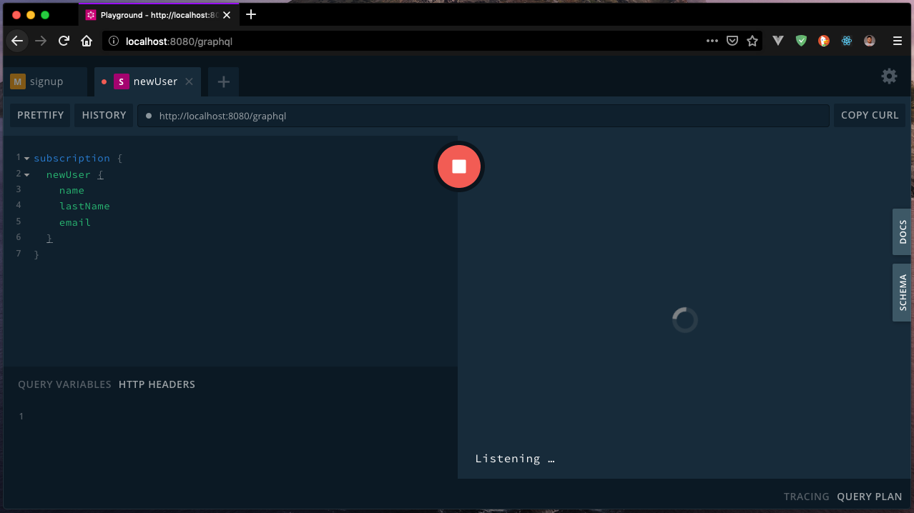
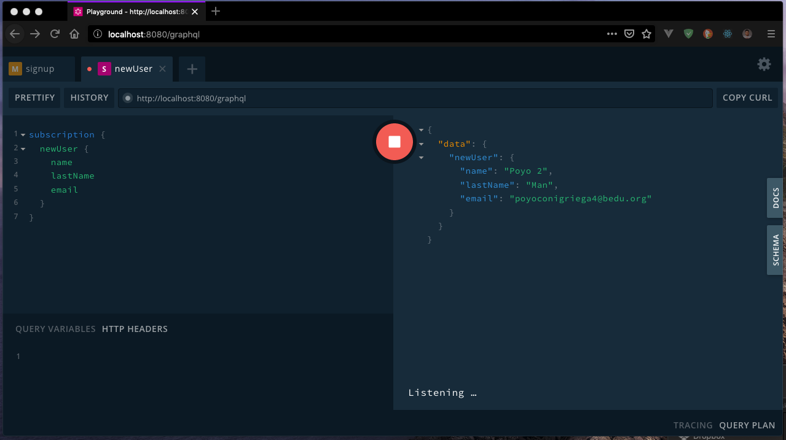

##### EJEMPLO 03
## SUSCRIPCIONES EN GRAPHQL

### OBJETIVO
Crear suscripciones para obtener cambios en el estado en tiempo real dentro de una aplicación.

### REQUERIMIENTOS
1. Proyecto con GraphQL API. [Ejemplo 02](Ejemplo-02).
2. Mongo 4 o superior. [Download](https://www.mongodb.com/download-center/community).

### DESARROLLO
En GraphQL, utilizamos suscripciones para escuchar cambios especificos dentro de nuestra API. Apollo Server ya soporta de suscripciones, este encapsula un par de paquetes necesarios para configurar WebSockets en GraphQL: `graphql-subscriptions` y `subscriptions-transport-ws`. El paquete `graphql-subscriptions` provee una implementación del patrón PubSub, osea `publisher/suscriber` (quién publica/quien se suscribe). PubSub es esencial para publicar cambios de los datos desde el cuál los suscriptores (clientes) pueden consumir. El paquete `subscriptions-transport-ws` es un servidor de WebSocket y cliente que permite transportar suscripciones sobre webSockets. Apollo Server automaticamente incorpora ambos de estos paquetes para soportar suscripciones.

Por defecto, Apollo Server configura un WebSocket en `ws://localhost:8080`. Nosotros estamos utilizando `apollo-server-express` por lo tanto, solo tendremos que hacer algunos pasos para que las suscripciones funciones.

Primero, vamos a dirigirnos al archivo `src/index.js` e importaremos la función `createServer` desde el módulo `http`.
```js
import { createServer } from 'http';
```

Apollo Server puede automaticamente configurar suscripciones, pero para hacer esto, necesitamos un servidor HTTP. Para esto usaremos `createServer` para crear uno. Vamos a localizar el código donde el servicio de GraphQL es iniciado en un puerto en específico with `app.listen`. Y reemplazaremos el código con lo siguiente:
```js
const httpServer = createServer(app);
server.installSubscriptionHandlers(httpServer);

// Connecting to Mongo DB
mongoose.connect(APP_MONGO_URI, { useNewUrlParser: true }).then(() => {
  httpServer.listen({ port: APP_PORT }, () => {
    console.log(`GraphQL API Service: 0.0.0.0:${APP_PORT}/graphql`);
    console.log(`GraphQL Playground: 0.0.0.0:${APP_PORT}/playground`);
    console.log(`Mongo DB Service: ${APP_MONGO_URI}`);
  });
}).catch(err => {
  throw new Error(err)
});
```

Dentro de esto, nosotros primeramente creamos un nuevo `httpServer` usando una instancia de Express. El `httpServer` esta listo para recibir todas las peticiones HTTP enviadas basada en nuestra configuración de Express. La siguiente línea de código, `server.installSubscriptionHandlers(httpServer)` es quién hace el trabajo con los WebSockets. Aquí, es donde Apollo Server agrega los handlers necesarios para soportar suscripciones con WebSockets. En adición a nuestro servidor HTTP, nuestro backend esta ahora listo para recibir peticiones en `ws://localhost:8080/graphql`.

Ahora, nuestro servicio soporta Suscripciones, es hora de implementarlos.

Lo primero que debemos hacer, es crear una instancia de `PubSub` para abrir un canal de comunicación, para eso antes del código donde tenemos definido nuestro servidor de Apollo Server, vamos a crear una nueva instancia de PubSub. Para poder hacer uso de `PubSub` lo podremos importar desde el paquete de `apollo-server-express`.
```js
import { ApolloServer, PubSub } from 'apollo-server-express';

// ...
const pubsub = new PubSub();

// Added schema definitions and resolvers
const server = new ApolloServer({
  // ...
});
```

Una ves que generamos esta nueva instancia, vamos a propagarlo a través del contexto de GraphQL.
```js
// ...
const pubsub = new PubSub();

// Added schema definitions and resolvers
const server = new ApolloServer({
  typeDefs: schema,
  resolvers,
  context: ({ req }) => {
    let currentUser;
    const token = req.headers.authorization;
    if (token) {
      currentUser = jwt.verify(token, APP_JWT_SECRET);
    }
    return { ...req, currentUser, pubsub };
  },
});
```

Una vez hecho esto, vamos a agregar la lógica de nuestra suscripción. Primero, vamos a agregar dentro del archivo `src/schema/schemaDefinition.graphql` la definición del tipo `Suscription`.
```graphql
schema {
  query: Query
  mutation: Mutation
  subscription: Subscription
}
```

Una vez definido el tipo, vamos a crear un nuevo archivo llamado `src/schema/subscription.graphql` donde definiremos nuestra `Subscription`.
```graphql
type Subscription {
  newUser: User!
}
```

Y por último, lo agregamos a nuestro archivo `src/schema/index.js`.
```js
// Import schema definition
import SchemaDefinition from './schemaDefinition.graphql';
import Types from './types.graphql';

// Import Queries and Mutations
import Query from './query.graphql';
import Mutation from './mutation.graphql';
import Subscription from './subscription.graphql';

export default [SchemaDefinition, Types, Query, Mutation, Subscription];
```

Una vez definida la suscripción dentro de nuestro servicio GraphQL, necesitamos crear el `resolver` que se encargara de suscribir el evento. Para ello, vamos a crear un archivo llamado `subscription.js` dentro del directorio `src/resolvers`.
```js
const Subscription = {
  newUser: {
    subscribe: (_, args, { pubsub }) => pubsub.asyncIterator(['user-added'])
  },
};

export default Subscription;
```

Ahora, nos encargaremos de cargarlo a nuestros `resolvers` para que GraphQL ejecute la lógica, para eso vamos a agregarlo dentro de nuestro archivo `src/resolvers/index.js`.
```js
import Query from './query';
import Mutation from './mutation';
import Subscription from './subscription';

const resolvers = {
  Query,
  Mutation,
  Subscription,
};

export default resolvers;
```

Con esto, ya tenemos el servicio cargado con la suscripción, por lo tanto, vamos a indicarle que comience a publicar los cambios a través de `PubSub`. Para esto, vamos a localizar el archivo `src/resolvers/mutation.js` en el método `signup` y vamos a agregar la publicación del evento una ves que el usuario haya sido guardado.
```js
pubsub.publish('user-added', { newUser });
```

Ahora vamos a probar la suscripción accediendo a `http://localhost:8080/graphql` y lanzaremos la siguiente prueba, una vez que ejecutemos la suscripción, podremos observar que se mantiene el botón con un stop, esto significa que nuestra suscripción esta escuchando el evento de la suscripción.



Ya que nuestra suscripción este ejecutada, vamos a lanzar la creación de un nuevo usuario y si todo ha ido bien, podremos observar el nuevo usuario creado en nuestra suscripción.

