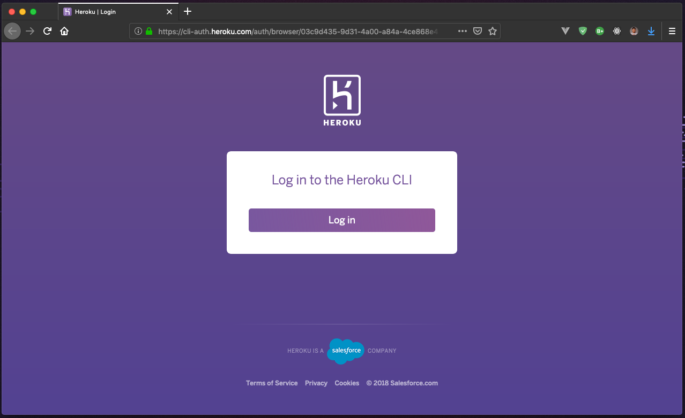
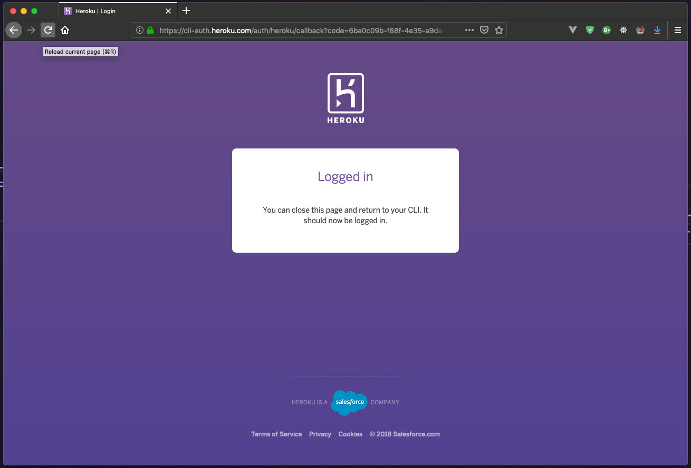
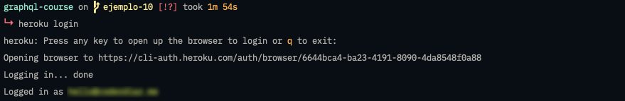
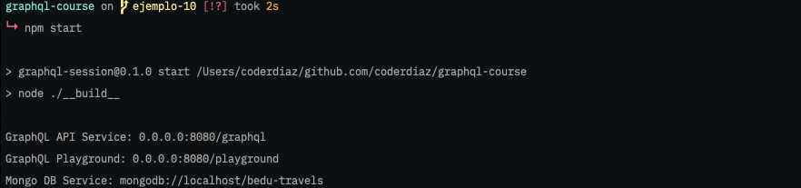
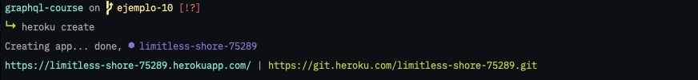
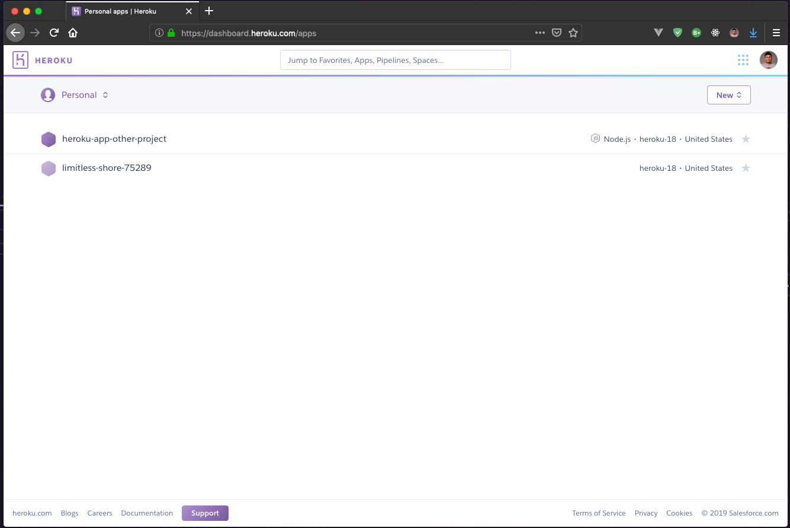
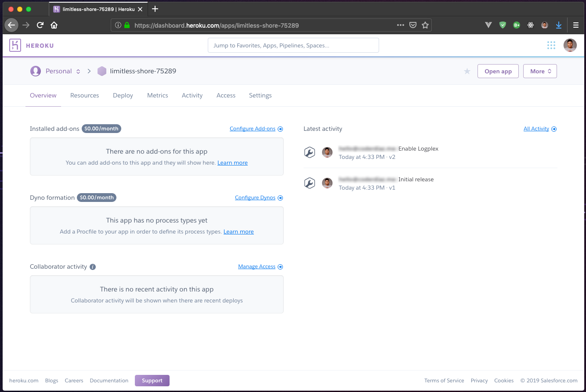
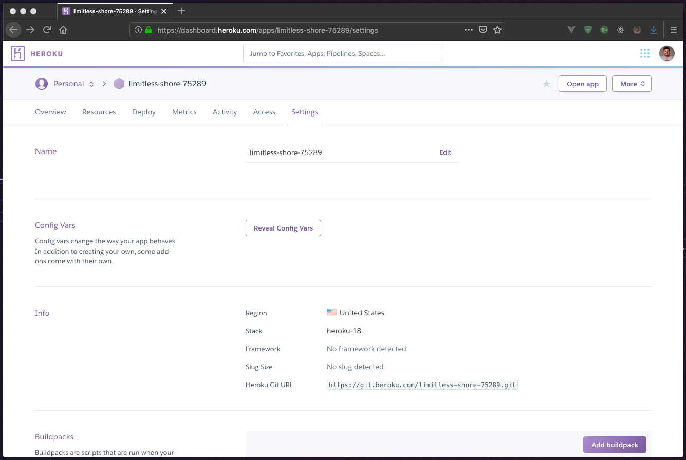
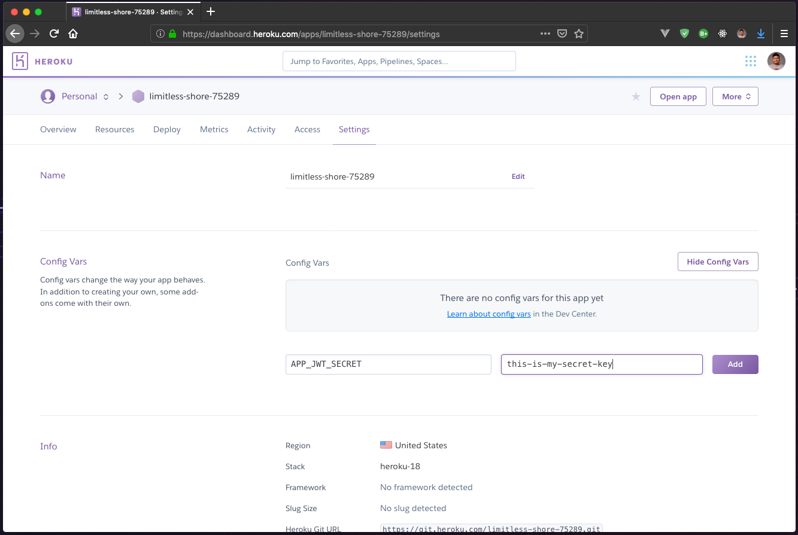

##### EJEMPLO 1
## DEZPLEGAR UN API GRAPHQL UTILIZANDO HEROKU

### OBJETIVO
Deplegar la  aplicación en un ambiente de producción utilizando Heroku.

### REQUERIMIENTOS
1. Una cuenta de Heroku. [Crear cuenta](https://signup.heroku.com/) o [Acceder](https://id.heroku.com/login).
2. Heroku CLI. [Download](https://devcenter.heroku.com/articles/heroku-cli#download-and-install).

### DESARROLLO
Lo primero que debemos verificar es nuestra instalación de Heroku CLI, ya que lo utilizaremos para crear nuestra aplicación en Heroku.
```sh
$ heroku --version
# heroku/7.25.0 darwin-x64 node-v11.14.0
```

Un vez hayamos verificado que tenemos listo el ambiente, lo que tendremos que hacer es autenticarnos dentro del servicio. Vamos a lanzar el siguiente comando:
```sh
$ heroku login
```

El comando anterior, te pedirá que presiones cualquier tecla para abrir una nueva página en tu navegador predeterminado.



Ahora vamos a hacer clic sobre el botón `Log In` para colocar nuestras credenciales de acceso a Heroku. Para eso, deberás haber creado tu cuenta especificado en los requisitos del ejemplo.

Si haz introducido tus credenciales correctamente, podrás observar lo siguiente, indicandote que se ha iniciado sesión de forma correcta.



Así mismo, si abrimos nuevamente nuestra terminal, ahora podremos observar que  nos indica la cuenta con que nos hemos autenticado.



Ahora que ya nos hemos autenticado, vamos a colocarnos en el directorio de nuestro proyecto de `BeduTravels` para hacer unas modificaciones necesarias para poder ejecutar nuestro proyecto en producción. Lo primero que debes saber, es que nuestro proyecto esta elaborado usando Babel, ya que este nos permite construir aplicaciones usando las nuevas caracteristicas de ES6, pero, esto implica un problema, actualmente en las nuevas versiones de Node, aunque han sido incorporadas alguna funciones dentro del Core de Node, este no tiene el soporte completo. Es por ello, que lo primero que debemos hacer, es transpilar nuestro código a un código que si pueda interpretar Node sin ningún tipo de problema.

Vamos a agregar a nuestro `package.json` las tareas necesarias para transpilar el código y ejecutarlo.
```json
"scripts": {
  "start": "node ./__build__",
  "build": "babel ./src -d ./__build__ -D -s",
}
```

**Nota:** Lo que le estamos indicando dentro del proceso de construcción es que vamos a usar el directorio `src` y vamos a crear un nuevo directorio de salida `__build__` donde se almacenaran nuestros archivos. Las banderas siguientes, nos indican opciones que se activan dentro del CLI de Babel:
  - `-D`: Es equivalente a `--copy-files` que nos permite el copiar los archivos dentro del directorio `__build__` ya procesados.
  - `-s`: Para habilitar la creación de los `sourcemaps`.

Si quieres saber más al respecto sobre estos parámetros, puedes ejecutar dentro del proyecto `./node_modules/.bin/babel --help`.

Ahora vamos a hacer una modificación dentro de las variables de entorno, ya que el puerto lo tenemos definido a través de la variable `APP_PORT`, pero, como ahora vamos a utilizar Heroku, nosotros no podemos especificar un puerto en especifico. Para corregir este problema, Heroku utiliza la variable `PORT` dentro de las variables de entorno para poder asignar un puerto dentro de su servicio.

Para hacer esta modificación, vamos a dirigirnos al archivo `src/index.js` y cambiaremos la lógica para obtener la nueva variable.
```js
const APP_PORT = process.env.PORT || 8080;
```

También, recuerda modificar la variable dentro de tu archivo `.env` local para que esta pueda ser leída.

Vamos compilar y ejecutar nuestro proyecto.
```sh
# Transpilando código
$ npm run build

# Ejecutando proyecto
$ npm run start
```

Como podrás ver tenemos un error, `regeneratorRuntime is not defined` parece ser que nuestro compilado no tiene la habilidad de poder ejecutar código con `async/await` y por ello, tendremos que agregar este soporte al código.

Esto lo vamos a corregir agregando una librería de babel, `babel-polyfill`, esta librería nos permitirá agregarle todo lo necesario a nuestro código que todavía no puede ser ejecutado y dando la posibilidad a que se ejecute.

Para que esto funcione, tendremos que mover la dependencia de `babel-polyfill` de `devDependencies` a `dependencies`.
```json
"dependencies": {
  "babel-polyfill": "^6.26.0",
  ...
},
```

Una vez que ya hemos movido nuestra dependencia, vamos a agregarla a nuestro archivo `src/index.js` para que sea agregada.
```js
import 'babel-polyfill`;
```

Vamos a transpilar y ejecutar nuevamente nuestro proyecto.
```sh
# Transpilando código
$ npm run build

# Ejecutando proyecto
$ npm run start
```


Si obtuviste un resultado como el de la imagen anterior, entonces vamos a guardar estos cambios en el repositorio.

Ahora, para lograr desplegar nuestra aplicación vamos a crear un archivo de configuración de Heroku en el directorio `root` del proyecto. Este archivo se llamará `Procfile` y agregaremos la siguiente configuración:
```
web: npm start
```

Por último, vamos a agregar los engines con los que la aplicación se ejecuta de forma correcta, esto lo vamos a agregar dentro de nuestro archivo `package.json`.
```json
"engines": {
  "node": "10.15.3",
  "npm": "6.4.1",
  "yarn": "1.16.0"
}
```

**Nota:** En este caso, esta configuración corresponde a la versión de las distintas herramientas con las que estoy trabajando actualmente.

Ahora, una vez que hemos preparado nuestro proyecto para correr en producción vamos a crear nuestra aplicación. Para ello, nos vamos a posicionar en nuestro directorio del proyecto y crearemos el nuevo proyecto en Heroku.
```sh
$ heroku create
```

Para comprobar el resultado de la ejecución anterior, primero podrás notar que donde hemos lanzado el comando, ahora te mostrado una URL y la dirección al repositorio de Git en Heroku. De esta forma, podremos subir nuestros cambios a Heroku, además podrás comprobar ejecutando `git remote -v` que te ha agregado el nuevo origen a tu proyecto Git.

```
heroku	https://git.heroku.com/limitless-shore-75289.git (fetch)
heroku	https://git.heroku.com/limitless-shore-75289.git (push)
```



Ahora, vamos a acceder a nuestra sesión de Heroku, vamos a abrir en un navegador la página `https://dashboard.heroku.com`, colocaremos nuestras credenciales y podrás ver tu aplicación creada (En caso de que ya hayas creado anteriormente aplicaciones en Heroku, tendremos todas en este listado).



Una vez aquí, vamos a proceder a agregar nuestras variables de entorno necesarias, para eso vamos a dar clic sobre nuestra aplicación creada y vamos a dirigirnos a la sección de `Settings`.




Dentro de la pantalla de `Settings` vamos a dar clic sobre el botón `Reveal Config Vars` y podremos observar un formulario para registrar nuestras variables de entorno. Estas son las variables que vamos a configurar.
```
APP_JWT_SECRET=your-secret-key
```



Por ahora, ya tenemos configurada nuestra aplicación, en la siguiente sección vamos a configurar nuestro entorno de Mongo DB en Heroku.