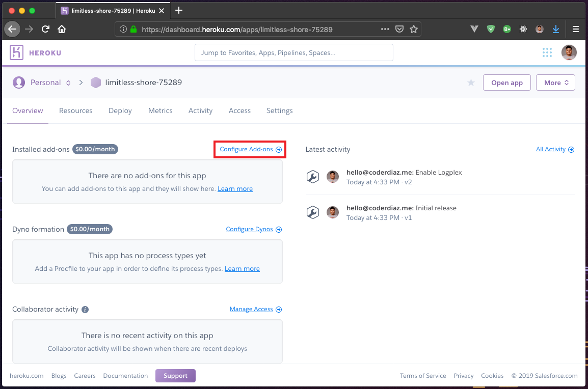
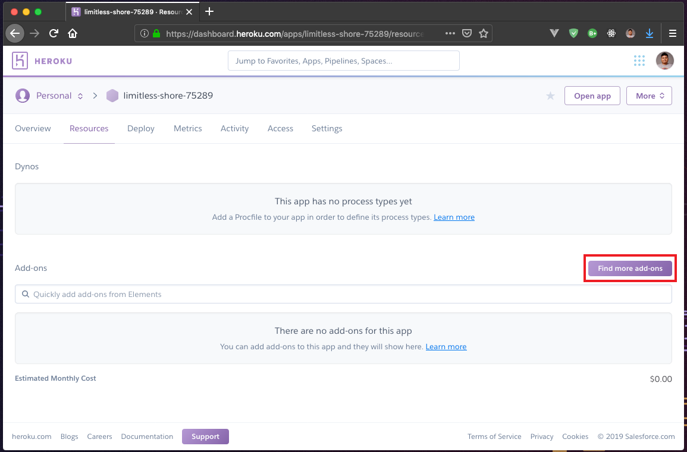
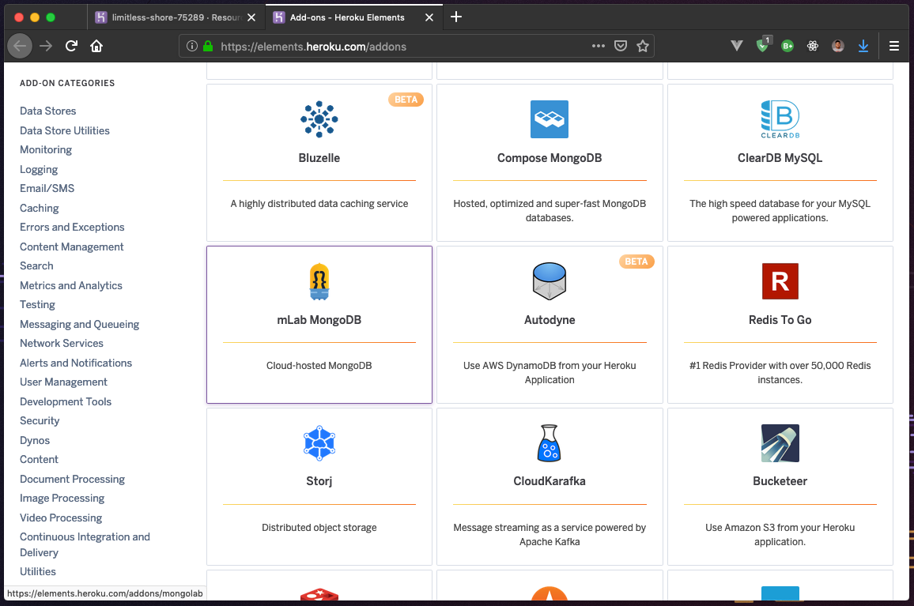
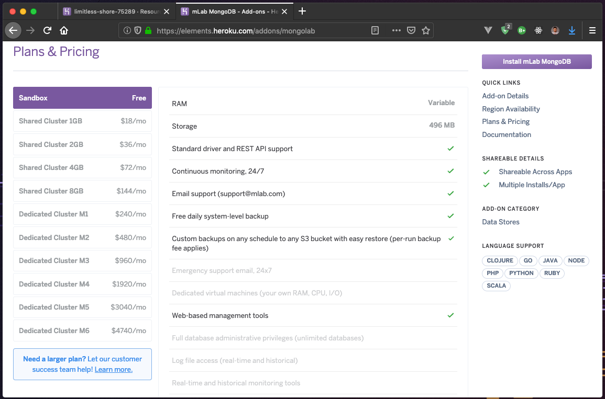
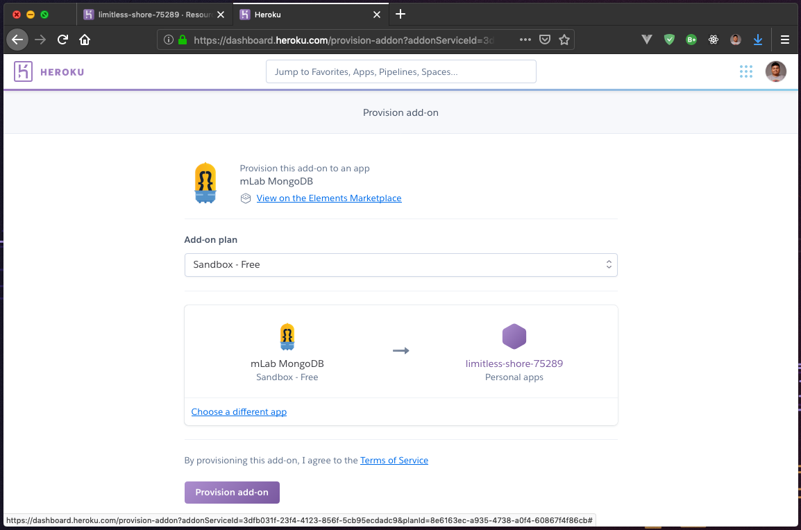
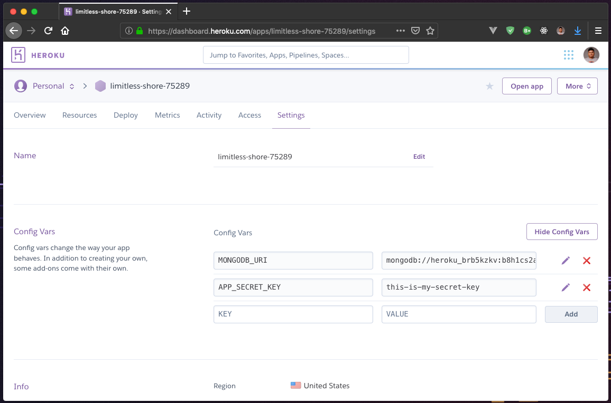
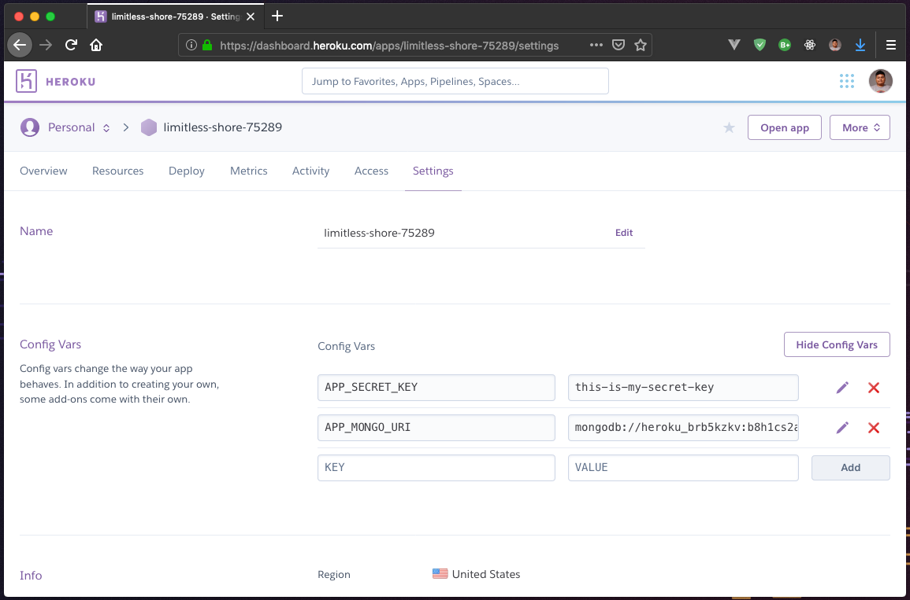
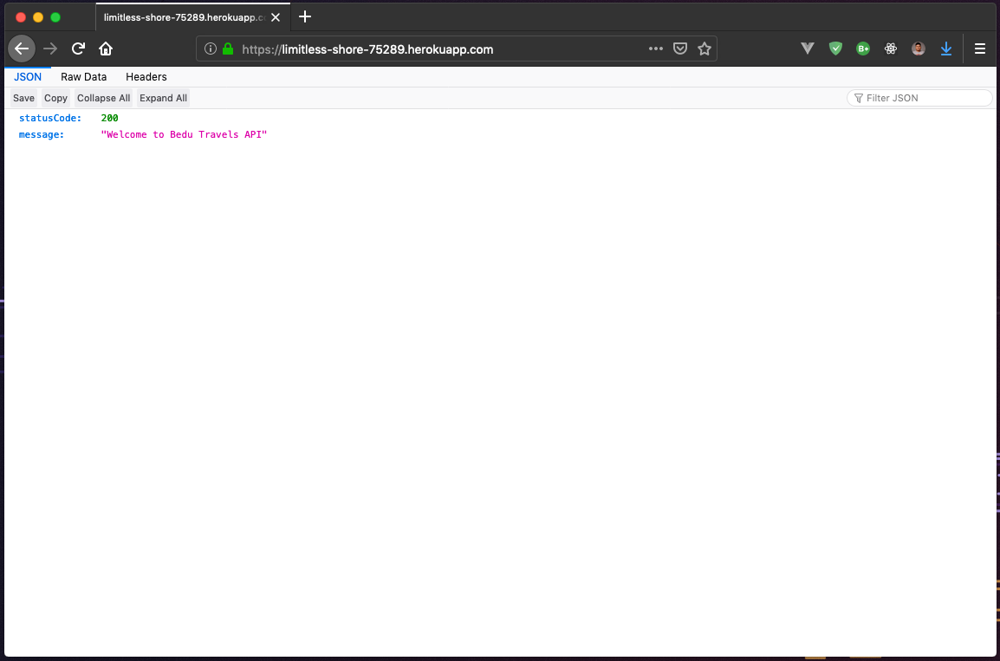
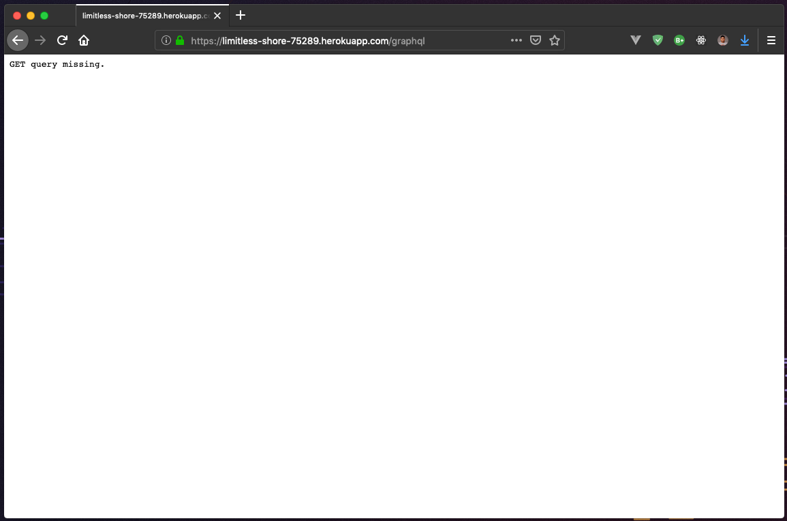

##### EJEMPLO 11
## CONFIGURANDO MONGO EN HEROKU USANDO MLAB.

### OBJETIVO
Configurar nuestra base de datos del proyecto en Heroku utilizando mLab.

### REQUERIMIENTOS
1. Proyecto con GraphQL API. [Ejemplo 10](https://github.com/coderdiaz/graphql-course-express/tree/ejemplo-11).
2. Una cuenta de Heroku. [Acceder](https://id.heroku.com/login).
3. Tu proyecto de Heroku creado.

### DESARROLLO
Antes de iniciar, vamos a autenticarnos dentro de Heroku y acceder a nuestro proyecto creado. Estando en nuestra página principal del proyecto, vamos a ingresar a la sección de `Configure Add-ons` para agregar el complemento de Mongo DB.



En la página de configuración de complementos, podremos observar todos nuestros complementos añadidos, en este caso, como no tenemos aún ninguno agregado, vamos a dar clic sobre el botón `Find more add-ons`.



En esta página, podremos ver todos los complementos que podemos añadir a nuestro proyecto, vamos a buscar `mLab MongoDB`.



Vamos a dar clic sobre `mLab MongoDB` y veremos la sección de configuración, en este caso, aquí podemos seleccionar nuestro Plan necesario para el proyecto, en este caso, como vamos a probar una aplicación, no necesitamos una base de datos con bastantes recursos, por esta razón, vamos a hacer uso del plan `Sandbox`.



Para hacer la instalación del complemento, vamos a dar clic sobre el botón `Install mLab MongoDB`. Esto nos mostrará una pantalla en donde enlazaremos el servicio de `mlab` a nuestra aplicación en Heroku. Para eso, vamos a escribir el nombre que se le asigno a nuestra aplicación, en este caso, mi aplicación se llama `limitless-shore-75289`. La seleccionamos y damos clic sobre el botón `Provision add-on`.



Ahora, que ya hemos agregado `mLab` podremos ver una nueva variable de entorno con la configuración.



Pero dentro de nuestro proyecto, nosotros no estamos haciendo uso de la variable `MONGODB_URI`, vamos a cambiarlo por la variable `APP_MONGO_URI` y pondremos el mismo valor de la variable.



Con esto, ya tenemos el ambiente preparado, ahora necesitamos crear una rama `master` basada en este ejemplo `git checkout -b ejemplo-11`, y lo subiremos a Heroku para comenzar con el despliegue de la aplicación.
```sh
# Creando rama master
$ git checkout -b master

# Desplegando rama master en Heroku
$ git push -u heroku master
```

Lo que podrás observar es un log como este en donde podrás ver todo el proceso de despliegue.
```
Total 0 (delta 0), reused 0 (delta 0)
remote: Compressing source files... done.
remote: Building source:
remote:
remote: -----> Node.js app detected
remote:
remote: -----> Creating runtime environment
remote:
remote:        NPM_CONFIG_LOGLEVEL=error
remote:        NODE_ENV=production
remote:        NODE_MODULES_CACHE=true
remote:        NODE_VERBOSE=false
remote:
remote: -----> Installing binaries
remote:        engines.node (package.json):  10.15.3
remote:        engines.npm (package.json):   6.4.1
remote:        engines.yarn (package.json):  1.16.0
remote:
remote:        Resolving node version 10.15.3...
remote:        Downloading and installing node 10.15.3...
remote:        npm 6.4.1 already installed with node
remote:        Resolving yarn version 1.16.0...
remote:        Downloading and installing yarn (1.16.0)...
remote:        Installed yarn 1.16.0
remote:
remote: -----> Installing dependencies
remote:        Installing node modules (yarn.lock)
remote:        yarn install v1.16.0
remote:        warning package.json: No license field
remote:        warning graphql-session@0.1.0: No license field
remote:        [1/4] Resolving packages...
remote:        [2/4] Fetching packages...
remote:        info fsevents@1.2.9: The platform "linux" is incompatible with this module.
remote:        info "fsevents@1.2.9" is an optional dependency and failed compatibility check. Excluding it from installation.
remote:        [3/4] Linking dependencies...
remote:        warning " > babel-eslint@10.0.1" has unmet peer dependency "eslint@>= 4.12.1".
remote:        warning " > babel-loader@8.0.6" has unmet peer dependency "@babel/core@^7.0.0".
remote:        warning " > babel-loader@8.0.6" has unmet peer dependency "webpack@>=2".
remote:        [4/4] Building fresh packages...
remote:        Done in 15.81s.
remote:
remote: -----> Build
remote:        Detected both "build" and "heroku-postbuild" scripts
remote:        Running heroku-postbuild (yarn)
remote:        yarn run v1.16.0
remote: warning package.json: No license field
remote:        $ npm run build
remote:
remote:        > graphql-session@0.1.0 build /tmp/build_305abb6294acfb4f22f946f1caccb161
remote:        > babel ./src -d ./__build__ -D -s
remote:
remote:        src/index.js -> __build__/index.js
remote:        src/models/User.js -> __build__/models/User.js
remote:        src/resolvers/index.js -> __build__/resolvers/index.js
remote:        src/resolvers/mutation.js -> __build__/resolvers/mutation.js
remote:        src/resolvers/query.js -> __build__/resolvers/query.js
remote:        src/resolvers/subscription.js -> __build__/resolvers/subscription.js
remote:        src/schema/index.js -> __build__/schema/index.js
remote:        Done in 1.40s.
remote:
remote: -----> Caching build
remote:        - node_modules
remote:
remote: -----> Pruning devDependencies
remote:        yarn install v1.16.0
remote:        warning package.json: No license field
remote:        warning graphql-session@0.1.0: No license field
remote:        [1/4] Resolving packages...
remote:        [2/4] Fetching packages...
remote:        info fsevents@1.2.9: The platform "linux" is incompatible with this module.
remote:        info "fsevents@1.2.9" is an optional dependency and failed compatibility check. Excluding it from installation.
remote:        [3/4] Linking dependencies...
remote:        warning " > babel-eslint@10.0.1" has unmet peer dependency "eslint@>= 4.12.1".
remote:        warning " > babel-loader@8.0.6" has unmet peer dependency "@babel/core@^7.0.0".
remote:        warning " > babel-loader@8.0.6" has unmet peer dependency "webpack@>=2".
remote:        [4/4] Building fresh packages...
remote:        warning Ignored scripts due to flag.
remote:        Done in 3.03s.
remote:
remote: -----> Build succeeded!
remote:  !     Unmet dependencies don't fail yarn install but may cause runtime issues
remote:        https://github.com/npm/npm/issues/7494
remote:
remote: -----> Discovering process types
remote:        Procfile declares types -> web
remote:
remote: -----> Compressing...
remote:        Done: 28.9M
remote: -----> Launching...
remote:        Released v8
remote:        https://limitless-shore-75289.herokuapp.com/ deployed to Heroku
remote:
remote: Verifying deploy... done.
To https://git.heroku.com/limitless-shore-75289.git
 * [new branch]      master -> master
Branch 'master' set up to track remote branch 'master' from 'heroku'.
```

Como podrás ver, Heroku nos da una URL en donde podremos ver desplegada nuestra aplicación en este caso `https://limitless-shore-75289.herokuapp.com/`.



Si queremos ver, la sección de la página de GraphQL puedes dirigirte a `https://limitless-shore-75289.herokuapp.com/graphql`.



Listo, tenemos nuestra aplicación lista para usar.